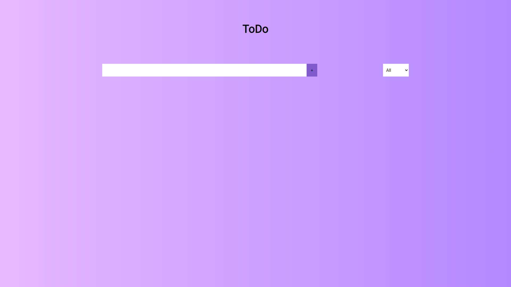
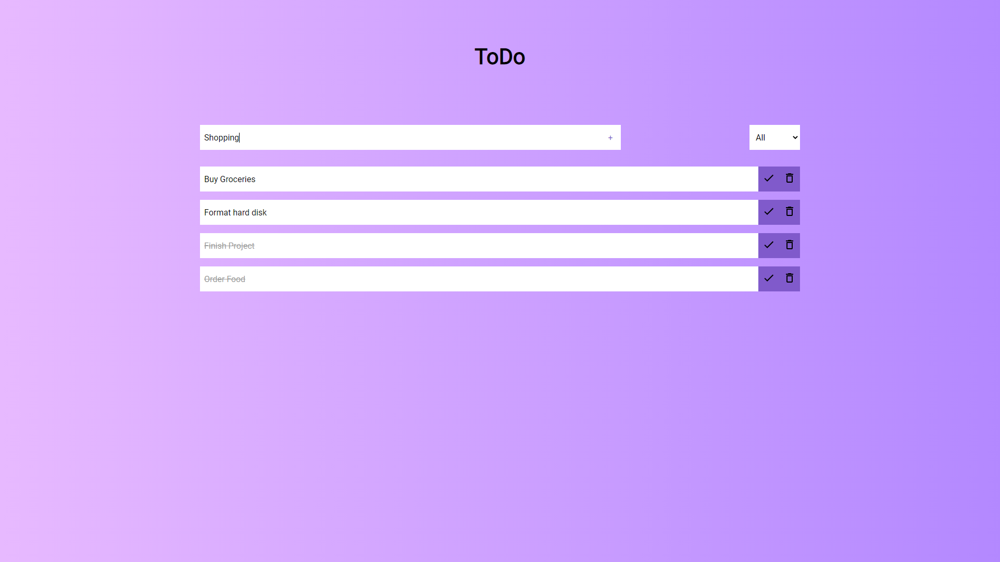
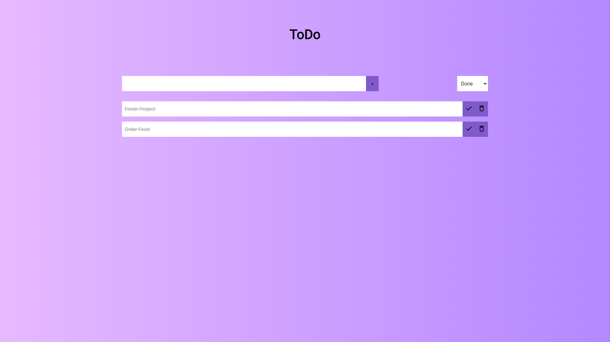
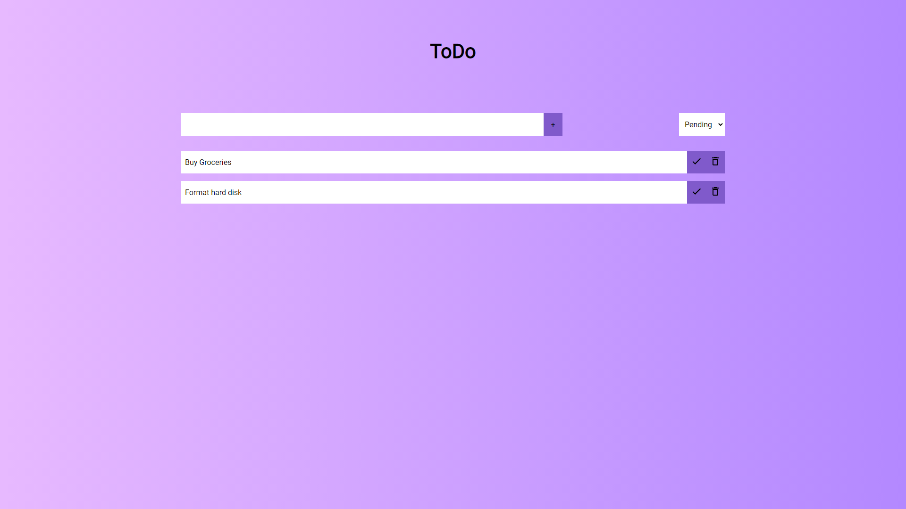
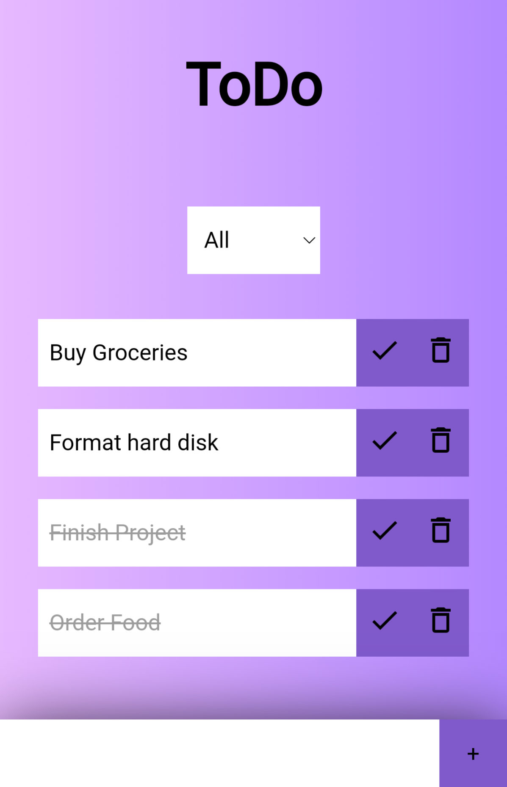
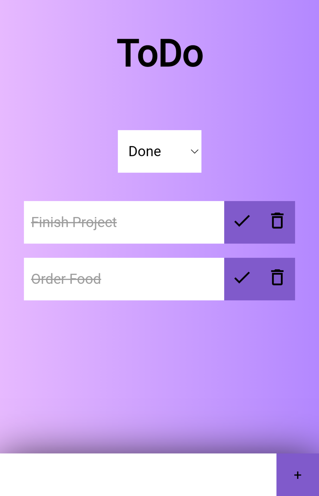
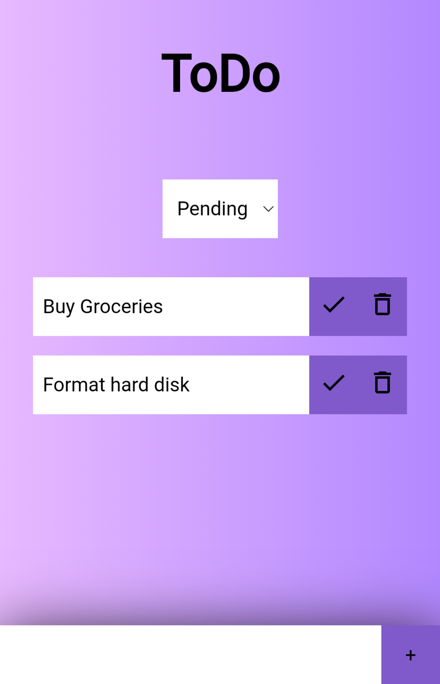

# React-ToDo
Todo list app built using react. Installable as a PWA (Progressive Web App).

 

## Getting Started
* Clone this repository `git clone {url}`
* `cd React-ToDo`
* `npm install` to install dependencies

 

## How to Use
* Execute `npm start` and `npm run style` to run the development server
* Execute `npm run build` to build the production server
* Execute `npm run deploy` to run the production server

 

## Demo

